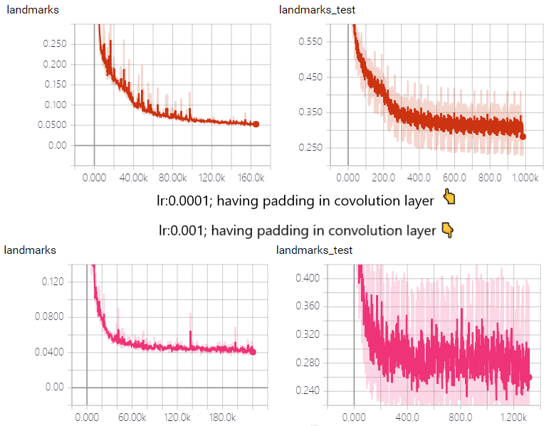
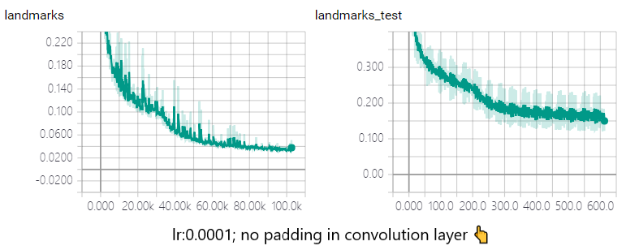
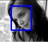
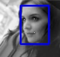
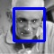

#### TCDCN代码
- 说明：
    - 网络结构的问题，开始是仿写github的prototxt，所以前两个卷积
    层都有padding；后又有更改，不加padding的效果好一点点，但是
    不是很明显
    - early stopping问题：TCDCN提出了一个提前停止支路任务的指数，
    但是实际使用中不是很容易确定（抖动），其实我现在是目测训练和
    测试阶段的loss下降情况，手动设置停止点。特点就是需要先行跑
    出比停止点更多的epoch。
    - 学习率：文章中提到的0.0001是比较好的.我试过0.001，下降速度
    更快，但是后期多一些抖动，是收敛不到最优解了，但是没停下来，
    毕竟使用的adam梯度下降方法，只要不是局部最优就可以。
    - 不同的padding：在早期加或者不加padding的差异就是第一个FC层
    的大小是不一致的。也就是最后一个卷积结果的大小分别为64*3*3和
    64*2*2差了差不多一倍，但是信息密度是不一样的，2*2的更高一些，
    从不同的结构对应的训练loss下降速度可以最比较。这一点，也可以
    参考MTCNN的网络结构，第三个卷积层之后就不带padding了
- 结果
    - loss
    - 
    - 
    - result
    - 
    
    
    
    - 
    
#### 运行示例
 - 参考test.py文件
 - evalution.py是使用AFLW来做精度评估
#### 其他TCDCN代码
- [TCDCN: matlab版SDK]( https://github.com/zhzhanp/TCDCN-face-alignment.git)
- [TCDCN: caffe的prototxt训练](https://github.com/lsy17096535/face-landmark.git)
- [TCDCN: 多个caffe版本的集合](https://github.com/cooparation/VanillaCNN_faceLandmark)
- [TCDCN: 68点的caffe版本](https://github.com/cunjian/face_alignment)
- [DCNN: 早期且直接的关键点回归方法](https://github.com/luoyetx/deep-landmark)
- [TCNN](https://github.com/ishay2b/VanillaCNN)
- [FAN](https://github.com/1adrianb/face-alignment.git)
- [DAN](https://github.com/MarekKowalski/DeepAlignmentNetwork)

#### 关于人脸关键点检测的科普文
- [人脸关键点检测发展简介综述(知乎版)](https://zhuanlan.zhihu.com/p/42968117)
- [人脸关键点数据库](https://www.fengiling.com/blog/view/?id=644926)
- [MTCNN(多任务检测)/FaceNet(认证)的科普](https://juejin.im/entry/5b0e0d98f265da092d519b0a)

#### 工程说明：
- 数据（tools/data_loader)
    - 使用普通的数据迭代器的方法，data_loader中的loader类
    - 使用HDF5的方法：首先创建一个hdf5，在使用numloader迭代。
- 网络（tools/net)
    - 使用TCDCN网络，论文中是不加padding，github中开源
    项目是有padding的，所以也有两个网络结构
    - 位置是net.py中第46行
- 优化方法（optimiztion/)
    - 主要目的是两个：1.近红外和可见光图片融合，再处理；2.
    还没想太好
- 可用的模型参数（log_DP)
    - log2/log4:使用的加padding的网络结构
    - log5:使用不加padding的网络结构
- _效果提升（loss设计）_
    1. 侧脸：
        - 现象：侧脸检测效果不佳
        - 思路：侧脸相对于正脸点位偏差较大，普通均方差loss
        会比较大之外，对另一侧点位的梯度是不正常的。
        - 方法：所以提出的方法是控制左右点位对loss的贡献，
        让偏差大的承担更多的loss
    2. 双眼和真值不平行
        - 现象：检测得到的双眼和真值不是一条平行线
        - 思路：使用的均方差目标函数，所以点位定位在真值周围一个
        范围内的效果是一致的。需要增加一个对y方向敏感的目标项。
        - 方法：做双眼的tan角度，对此差值做loss项
    3. 代码：  
        - 说明：此代码和之前的代码在训练时有一点差异，如需
        正常TCDCN的代码，则将此代码注销掉
        - 位置：net.py中NormlizedMSE函数中新增weight变量为对1.
        的处理。同函数中extraLoss为2.的处理。